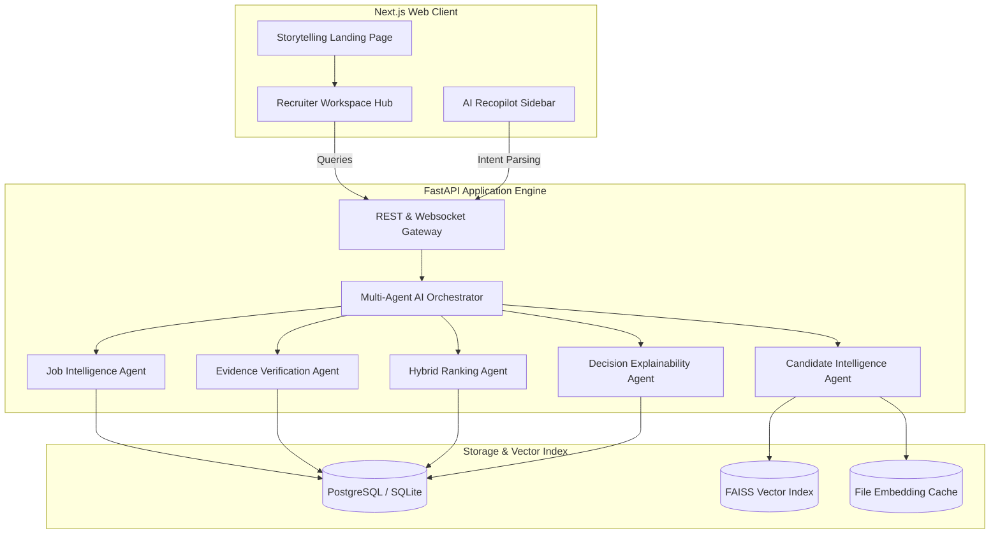

# TalentMind AI — Enterprise Talent Intelligence Platform

TalentMind AI is a state-of-the-art recruiter workspace that replaces keywords-based ATS resume filters with **Deep Career Intelligence, Inferred Capabilities Evidence Audit, and Explainable Recommendation Decisions**.

The platform is built as a dark-first premium interface (Next.js 16, Tailwind CSS, Framer Motion) integrated with a modular AI multi-agent orchestration backend (FastAPI, SQLite/PostgreSQL, FAISS Vector store, Cross-Encoder rerankers).

---

## Technical Architecture



---

## Platform Core Features

### 1. Cinematic Storytelling Landing Page
A scroll-driven visual journey that demonstrates the evolution of candidate search:
* **Chapter 1: The ATS Chaos**: Renders raw resume noise and parsed keyword tags.
* **Chapter 2: The Broken ATS**: Simulates typical boolean keyword failures.
* **Chapter 3: The AI Awakens**: Orchestrator nodes wake up to parse career timelines.
* **Chapter 4: Semantic Universe**: Shows vector spatial grouping of candidates.
* **Chapter 5: Recruiter Reasoning**: Displays AI candidate rationale tags side-by-side.

### 2. Recruiter Workspace Hub
A high-fidelity layout comprising seven core workspaces:
1. **Recruiter Dashboard**: Quick statistics on job sessions, system match speeds, active pipelines, and database version health logs.
2. **Job Ingestion Workspace**: Input job descriptions directly or select presets to run the 6-stage AI intelligence parsing pipeline.
3. **Candidate Database**: Ranked match listings displaying Match scores, Hiring confidence levels, Narrative summaries, Key strengths/gaps, and custom interview guide sheets. Also supports **direct PDF recruiter report downloads**.
4. **Candidate Comparison**: Side-by-side alignment matrix inspecting core attributes, leadership indexes, risk deductions, and decision differentiators.
5. **Hiring Analytics**: Custom distribution funnels and technology mix histograms.
6. **AI System Telemetry**: CPU, RAM, disk space, active agent health checks, and FAISS index vector count tracking.
7. **Scoring Settings**: Live ranges adjustment forms to sync matching weights directly to database preferences.

### 3. Interactive AI Recopilot Assistant
A context-aware sidebar helper querying backend APIs to answer recruit queries in real time:
* *"Compare the top candidates for the machine learning role."*
* *"Show missing stack capabilities for Candidate #1."*
* *"Explain why Candidate A is ranked higher than Candidate B."*

---

## Quick Start (Docker Compose Production)

To deploy the entire TalentMind AI environment (PostgreSQL Database, FastAPI Backend, Next.js Standalone Frontend):

```bash
# Clone the repository and run compose
docker-compose up --build -d

# Verify all containers are operational
docker-compose ps
```

* **Frontend Hub**: `http://localhost:3000`
* **FastAPI Docs**: `http://localhost:8000/docs`

For details on health checks and environment settings, see [deployment_guide.md](file:///c:/Users/user/Desktop/TalentMindAI_IndiaRuns/deployment_guide.md).

---

## Local Development Setup

### Backend (Python FastAPI)
1. Navigate to directory and install dependencies:
   ```bash
   cd backend
   python -m venv .venv
   .\.venv\Scripts\activate
   pip install -r requirements.txt
   ```
2. Start development server:
   ```bash
   uvicorn app.main:app --reload
   ```

### Frontend (Next.js)
1. Install node packages:
   ```bash
   npm install
   ```
2. Launch dev server:
   ```bash
   npm run dev
   ```
3. Run compiler build check:
   ```bash
   npm run build
   ```

---

## Verification & Testing

Verify system integrity by running the full Python pytest suite:
```bash
cd backend
.venv\Scripts\python -m pytest
```
All 79 test cases verify backend routers, agents, DB transactions, FAISS search, and deployment configurations.
