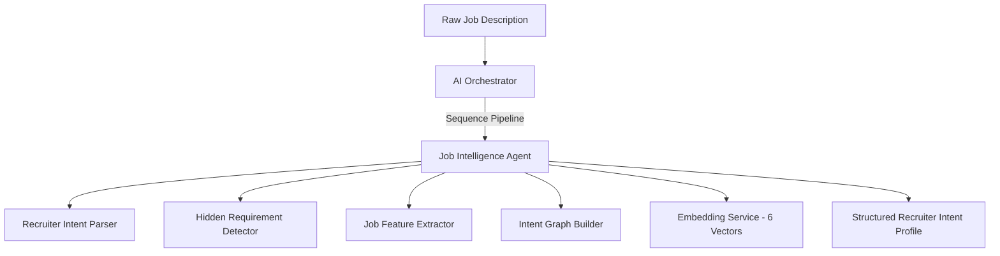
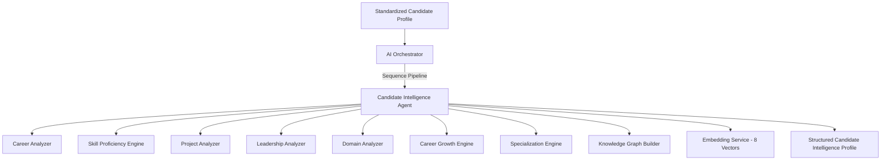
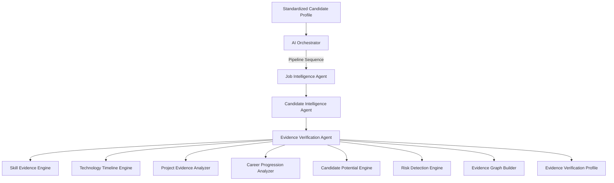
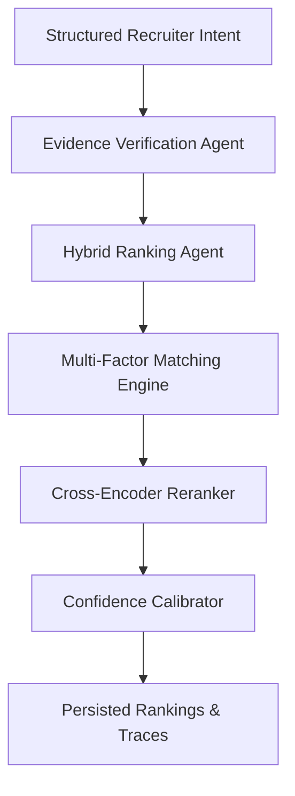
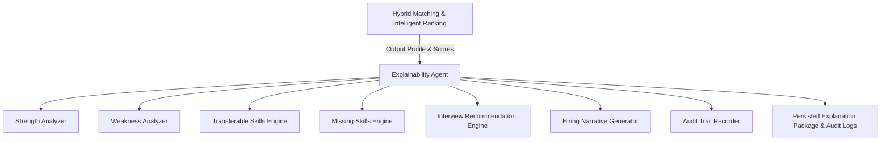

# TalentMind AI — Backend Platform Foundation (Phase 1)

This directory contains the production-ready backend service foundation for **TalentMind AI**, a candidate intelligence platform built to understand careers rather than keywords.

---

## Architecture Overview

The backend is built adhering to **Clean Architecture** and **SOLID** principles:

```
          API Layer (FastAPI Routers & Middleware)
                            ↓
     Application Layer (Dependencies & Request Controllers)
                            ↓
         Business Use Cases (Interactors - Phase 2)
                            ↓
            Domain Models & Repository Interfaces
                            ↓
       Infrastructure (SQLAlchemy, Vector Databases, LLMs)
```

### Key Design Patterns Implemented:
* **Repository Pattern**: Insulates database transactions from business cases using a generic asynchronous `BaseRepository`.
* **Provider Abstraction**: Defines abstract base classes (`BaseEmbeddingProvider`, `BaseLLMProvider`, etc.) to keep external vendor libraries replaceable.
* **Dependency Injection**: Utilizes FastAPI's `Depends` for database connections, telemetry metrics, and user authentication checks.
* **Feature Toggles**: Provides a centralized `FeatureFlagManager` class supporting environment-driven module activation.

---

## Directory Structure

```
backend/
├── app/
│   ├── api/
│   │   └── v1/
│   │       ├── dependencies/    # DB session & Auth injection context
│   │       └── routers/         # REST Router definitions (e.g. health)
│   ├── core/
│   │   ├── config/              # Typed configurations (Pydantic Settings)
│   │   ├── feature_flags/       # Module toggles management
│   │   ├── logging/             # Structured JSON logger (Structlog)
│   │   └── middleware/          # CORS, security headers, request timers
│   ├── database/
│   │   ├── models/              # Declarative tables & UUID/timestamp mixins
│   │   ├── repositories/        # Asynchronous CRUD base repositories
│   │   └── session.py           # DB connection builder with SQLite fallback
│   ├── domain/                  # Empty placeholder for domain rules (Phase 2)
│   ├── providers/               # Abstract provider interfaces
│   ├── schemas/                 # API request/response models (responses.py)
│   ├── telemetry/               # Telemetry metric hooks & resources logger
│   └── main.py                  # API entry point & exception filters
├── tests/                       # Async Pytest suites
├── Dockerfile                   # Multi-stage secure build configuration
└── docker-compose.yml           # Database and application compose container configuration
```

---

## Getting Started

### Local Setup (Virtual Environment)

1. Navigate to the backend directory:
   ```bash
   cd backend
   ```
2. Initialize virtual environment and activate:
   ```bash
   python -m venv .venv
   # Windows PowerShell:
   .\.venv\Scripts\activate
   # macOS / Linux:
   source .venv/bin/activate
   ```
3. Install required libraries:
   ```bash
   pip install -r requirements.txt
   ```
4. Copy the environment variables template and customize:
   ```bash
   cp .env.example .env
   ```
5. Start local server with hot reloading:
   ```bash
   uvicorn app.main:app --reload
   ```
   Open the API documentation page: [http://localhost:8000/docs](http://localhost:8000/docs).

---

## Environment Variables Configuration

| Variable | Description | Default |
| :--- | :--- | :--- |
| `APP_ENV` | Application lifecycle context (`development`, `production`, `testing`) | `development` |
| `APP_DEBUG` | Activates debug parameters and details | `true` |
| `DATABASE_URL` | PostgreSQL connection URL | `postgresql+asyncpg://...` |
| `SQLITE_DATABASE_URL` | Local SQLite fallback connection URL | `sqlite+aiosqlite:///./...` |
| `LOG_LEVEL` | Log severity threshold (`DEBUG`, `INFO`, `WARNING`, `ERROR`) | `INFO` |
| `JSON_LOGS` | Toggles output formatting between JSON and clean prints | `false` |
| `FLAG_SEMANTIC_SEARCH` | Toggles semantic retrieval engine | `true` |
| `FLAG_AUTHENTICATION` | Toggles OAuth/JWT token checks | `false` |

---

## Testing & Checks

Run the Pytest suite verifying routing, logging, settings and async SQL sessions:
```bash
python -m pytest
```

---

## AI Multi-Agent & Job Intelligence Architecture (Phase 2)

We have extended the base foundation with a pluggable, deterministic, and modular AI Multi-Agent System designed to process raw job descriptions into structured recruiter intent.

### 1. AI Orchestrator & Agent Interface

All agents in the TalentMind AI platform implement a common lifecycle contract via `BaseAgent` (`backend/app/services/agents/base.py`). This guarantees unified lifecycle hooks, tracing, validation, and diagnostics.



The `AIOrchestrator` (`backend/app/services/agents/orchestrator.py`) handles:
* **Registration**: Dynamically registers agents under unique names.
* **Pipeline Execution**: Chains multiple agents sequentially, sharing a common execution context dict.
* **Telemetry Tracing**: Records duration latency, memory RSS delta (via `psutil`), timestamps, and handles errors cleanly to output a detailed `AITrace`.

---

### 2. Job Intelligence Flow

The **Job Intelligence Agent** (`job_intelligence`) coordinates several underlying components:

#### Recruiter Intent Parser (`backend/app/services/intent_parser.py`)
Extracts explicit entities (title, department, education, location, salary range, seniority, location, remote compatibility, and skills) using catalog dictionaries and high-fidelity regular expressions.

#### Skill Classification & Hierarchy Engine (`backend/app/services/skill_classifier.py`)
Categorizes skills into multi-tier pathways. E.g.:
* `Python` → `Programming Language` → `Backend` → `AI Ecosystem`
* `Kubernetes` → `DevOps` → `Container Orchestration` → `Cloud Infrastructure`

If an untracked skill is parsed, it falls back to a semantic match using cosine similarity over local embeddings.

#### Hidden Requirement Detector (`backend/app/services/hidden_requirements.py`)
Infers implied requirements (e.g., *Leadership, ownership, mentorship, system design, scalability, startup/enterprise experience*) by splitting the text into sentences, running keyword scans, and computing semantic similarities to expectation definitions. It returns evidence-backed confidence scores.

#### Job Feature Extractor (`backend/app/services/job_feature_engineer.py`)
Generates structured recruiter features (e.g., `ai_experience`, `cloud_experience`, `leadership_required`, `startup_preference`, `remote_compatibility`) as clean, native Python types for downstream candidate matching algorithms.

---

### 3. Recruiter Intent Graph

The semantic graph (`backend/app/services/intent_graph.py`) structures extracted JD details as nodes and edges, mapping:

$$\text{Role} \longrightarrow \text{Responsibilities} \longrightarrow \text{Required Skills} \longrightarrow \text{Preferred Skills} \longrightarrow \text{Behavior} \longrightarrow \text{Experience} \longrightarrow \text{Industry} \longrightarrow \text{Technology Stack}$$

* **Nodes**: Include role details, experience requirements, behavior expectations (with confidence and evidence), and categorized tech stack groupings.
* **Edges**: Map directed relationships such as `requires_primary`, `requires_experience`, `requires_behavior`, `performs`, and `part_of_stack`.

---

### 4. Multi-Vector Embeddings

Rather than generating a single vector, the system generates **6 distinct embeddings** stored separately in the SQLite cache DB and FAISS collections:
1. **Overall JD**: Semantic representation of the raw description text.
2. **Skills**: Focuses purely on primary and secondary tools and frameworks.
3. **Responsibilities**: Encodes core job duties and sentence-level evidence snippets.
4. **Behavior**: Encodes soft skills and inferred expectations.
5. **Experience**: Represents seniority level and years required.
6. **Technology Stack**: Represents language, tool, and cloud platform catalogs.

---

### 5. LLM Prompt Templates & Provider Design

The `PromptTemplateManager` (`backend/app/services/prompt_templates.py`) defines provider-agnostic reusable schemas. It generates payload configurations matching specific target parameters for:
* **Local Transformers**: Uses standard tokenizer system/user template formatting.
* **Ollama**: Automatically enforces JSON formatting schemas.
* **OpenRouter**: Passes response format requirements as `json_object`.
* **HuggingFace Hub**: Maps instruct-prompt wrappers.

---

### 6. REST API Endpoints

All endpoints are mounted under `/jobs` in `backend/app/main.py`:
* `POST /jobs/analyze`: Executes full orchestrator pipeline (parsing, graph building, embedding, and saves to database).
* `POST /jobs/parse`: Quick extraction without persistence or embedding latencies.
* `GET /jobs/{id}`: Fetches fully analyzed job.
* `GET /jobs/{id}/intent`: Returns structured profile data.
* `GET /jobs/{id}/graph`: Returns intent graph nodes and edges.
* `GET /jobs/{id}/trace`: Returns execution trace details.

### 7. CLI Usage

Run job analysis directly from the console:
```bash
# General analysis & feature extraction printout
.venv/Scripts/python scripts/analyze_job.py --file path_to_jd.txt

# Run full orchestrator pipeline and save to DB
.venv/Scripts/python scripts/build_intent.py --save
```

---

## Candidate Intelligence Architecture (Phase 2 - Prompt 5)

We have extended the AI Multi-Agent System with the **Candidate Intelligence Agent** (`candidate_intelligence`), built to transform raw candidate profiles into high-fidelity structured intelligence profiles.



### 1. Inference Pipeline & Analyzers

The Candidate Intelligence Agent coordinates several specialized modules:

#### Career Analyzer (`backend/app/services/candidate_analyzers/career_analyzer.py`)
Computes career progression metrics, average promotion frequency, distinct company counts, consulting vs product dynamics, startup vs enterprise exposure, remote role history, and global international experience.

#### Skill Proficiency Engine (`backend/app/services/candidate_analyzers/technical_analyzer.py`)
Determines exact proficiency levels (`Beginner`, `Intermediate`, `Advanced`, `Expert`) for 18 tech categories (e.g. languages, frameworks, cloud, devops, databases). The levels are inferred using:
* **Years of usage** across job timelines.
* **Project evidence** count.
* **Recency** (current or recent usage).
* **Career consistency** (used across multiple companies).
* **Technology combinations** (e.g., Python + FastAPI boosts confidence).

#### Project Analyzer (`backend/app/services/candidate_analyzers/project_analyzer.py`)
Rates every project from 0 to 100 based on tech stack size, deployment scope, AI/cloud usage, security parameters, ownership level (Lead/Core/Contributor), complexity, scale, and business impact.

#### Leadership Analyzer (`backend/app/services/candidate_analyzers/leadership_analyzer.py`)
Infers team management, mentorship exposure, architecture ownership, decision making, cross-functional collaboration, and product ownership based on textual responsibility evidence.

#### Domain Analyzer (`backend/app/services/candidate_analyzers/domain_analyzer.py`)
Scans profile text and project metadata to detect vertical experiences in FinTech, HealthTech, EdTech, SaaS, AI, Cybersecurity, E-commerce, etc.

#### Career Growth Engine (`backend/app/services/candidate_analyzers/career_growth.py`)
Computes normalized metrics (0.0 to 1.0) for growth velocity, promotion rate, role expansion, learning rate, tech stack evolution, adaptability, and stability.

#### Specialization Engine (`backend/app/services/candidate_analyzers/specialization_engine.py`)
Classifies candidates into primary role personas (Backend, Frontend, Full Stack, DevOps, Cloud, AI, Security, Mobile, Architect, Engineering Manager).

---

### 2. Candidate Knowledge Graph

The relational knowledge graph (`backend/app/services/candidate_analyzers/candidate_graph.py`) maps candidate entities, skills, experiences, and achievements:

```
Candidate ──(HAS_EXPERIENCE)──> Experience ──(WORKED_AT)──> Company
    │                               │
(HAS_PROJECT)                  (HAS_ROLE)
    │                               │
    ▼                               ▼
 Project ───(USES_TECH)────────> Skill / Technology ◄──(HAS_SKILL)── Candidate
    │
(IN_DOMAIN)
    │
    ▼
  Domain ◄──(OPERATES_IN)───────────────────────────────────────────── Candidate
```

* **Nodes**: Represent `Candidate`, `Experience`, `Project`, `Skill`, `Company`, `Domain`, `Certification`, `Education`, and `Leadership`.
* **Edges**: Store directed connections like `HAS_EXPERIENCE`, `WORKED_AT`, `HAS_PROJECT`, `USES_TECH`, `IN_DOMAIN`, `HAS_SKILL`, `OPERATES_IN`, and `HAS_LEADERSHIP`.

---

### 3. Multi-Vector Embedding Strategy

We generate **8 distinct embeddings** representing separate candidate traits to support multi-dimensional similarity queries:
1. **Overall Candidate**: Encodes name, titles, specializations, overall ratings, and experience summaries.
2. **Career**: Encodes career progression, stability index, and role transitions.
3. **Projects**: Represents project summaries, complexities, scales, and ownership levels.
4. **Skills**: Focuses on technologies used and proficiency durations.
5. **Leadership**: Represents team leading, architecture ownership, and mentoring.
6. **Domains**: Encodes industry domains worked in and years of exposure.
7. **Specialization**: Represents matched software roles and scoring vectors.
8. **Knowledge Graph Summary**: Textual node/edge distribution representation.

---

### 4. Candidate Intelligence REST APIs

All candidate endpoints are mounted under `/candidate` prefix in `backend/app/main.py`:
* `POST /candidate/analyze`: Triggers the AI Orchestrator pipeline, runs all analyzers, builds the knowledge graph, generates/saves the 8 embeddings, and writes the profile to the database.
* `GET /candidate/{id}/intelligence`: Retrieves the full Career Intelligence profile.
* `GET /candidate/{id}/knowledge-graph`: Returns the structured graph nodes and edges.
* `GET /candidate/{id}/career-analysis`: Returns progression metrics.
* `GET /candidate/{id}/technical-analysis`: Returns skill proficiencies.
* `GET /candidate/{id}/leadership-analysis`: Returns evidence-backed leadership ratings.
* `GET /candidate/{id}/projects-analysis`: Returns individual project scores.
* `GET /candidate/{id}/domains`: Returns industry vertical durations.
* `GET /candidate/{id}/trace`: Returns execution telemetry traces.

---

### 5. CLI Usage

Execute candidate career intelligence analysis via console commands:
```bash
# Run full orchestrator pipeline and save results to DB
.venv/Scripts/python scripts/analyze_candidate.py --id cand_cli_01 --save

# Build and display candidate knowledge graph relations
.venv/Scripts/python scripts/build_candidate_graph.py --id cand_cli_01

# Display candidate career intelligence executive summary
.venv/Scripts/python scripts/candidate_summary.py --id cand_cli_01
```

---

## Evidence Verification Engine & Career Intelligence Engine (Phase 2 - Prompt 6)

We have extended the AI Multi-Agent System with the **Evidence Verification Agent** (`evidence_verification`), designed to verify whether every inferred capability about a candidate is supported by evidence in experiences, projects, certs, and timeline history.



### 1. Verification Modules & Engines

The Evidence Verification Agent integrates the following core capabilities:

#### Skill Evidence Engine (`backend/app/services/evidence_analyzers/skill_evidence.py`)
Computes an **Evidence Score** (0-100) and assigns a confidence level (`Verified`, `Likely`, `Weak`, `Unsupported`) to every claimed skill based on:
* Duration of usage.
* Project density and certification presence.
* Overlap with role history.

#### Technology Timeline Engine (`backend/app/services/evidence_analyzers/timeline_engine.py`)
Maps technologies used to specific calendar years. It runs a progression analysis to evaluate career stagnation, specialization transitions (e.g., backend -> cloud/AI), promotion velocity, and resilience.

#### Project Evidence Analyzer (`backend/app/services/evidence_analyzers/project_evidence.py`)
Inspects projects to compute a **Project Evidence Score** assessing scale, complexity, deployment depth, security, cloud exposure, and business impact.

#### Candidate Potential & Learning Velocity Engine (`backend/app/services/evidence_analyzers/potential_engine.py`)
Infers growth potential, innovation potential, and role readiness confidences across career tiers (Junior, Mid-level, Senior, Lead, Architect, Engineering Manager).

#### Risk Detection Engine (`backend/app/services/evidence_analyzers/risk_detector.py`)
Identifies resumes with tech stack inflation, keyword stuffing, employment gaps, career hopping, or contradictory leadership claims.

#### Evidence Graph Builder (`backend/app/services/evidence_analyzers/evidence_graph.py`)
Generates a queryable graph structuring candidate nodes connected through projects, experiences, certifications, technologies, active years, and verified skills.

---

### 2. Evidence Verification REST APIs

All verification endpoints are mounted under `/evidence` and `/candidate` prefixes:
* `POST /evidence/verify`: Executes verification pipeline and saves results.
* `GET /candidate/{id}/evidence`: Retrieves full verification report.
* `GET /candidate/{id}/timeline`: Retrieves chronological tech usage and career progression.
* `GET /candidate/{id}/potential`: Retrieves learning velocity, growth potential, and tier readiness.
* `GET /candidate/{id}/risk`: Retrieves CV risk level, total risk score, and anomaly explanations.
* `GET /candidate/{id}/verification`: Retrieves verified skill scores and categories.
* `GET /candidate/{id}/evidence-graph`: Retrieves the queryable graph representation.

---

### 3. CLI Usage

Execute candidate evidence verification via console commands:
```bash
# Run full orchestrator pipeline and save verification results to DB
.venv/Scripts/python scripts/verify_candidate.py --id cand_cli_01 --save

# Build and query candidate evidence graph relations
.venv/Scripts/python scripts/build_evidence_graph.py --id cand_cli_01

# Display candidate career progression and timeline analysis
.venv/Scripts/python scripts/career_analysis.py --id cand_cli_01
```

---

## Hybrid Matching & Intelligent Ranking Engine (Phase 2 - Prompt 7)

We have extended the AI Multi-Agent System with the **Hybrid Ranking Agent** (`hybrid_ranking`), designed to score and rank candidates against job requirements using fifteen independent matching dimensions, configurable scoring weights, second-stage Cross-Encoder reranking, and confidence calibration.



### 1. The 15 Matching Dimensions

The matching engine (`backend/app/services/matching/matching_engine.py`) implements:
* **Semantic Match**: Cosine similarity comparing job and candidate traits.
* **Skill Match**: Evaluates coverage, depth, recency, and confidence of skills.
* **Career Match**: Progression, growth transitions, and company profile diversity.
* **Technology Match**: Check tech usage timeline history and active years.
* **Leadership Match**: Team leading, mentoring, architecture ownership.
* **Domain Match**: Focus industry vertical alignment.
* **Education Match**: Degree checks (BS/MS/PhD) against JD.
* **Certification Match**: Certification impact score.
* **Project Match**: Scale, complexity, testing, deployment, cloud, security, business impact.
* **Experience Match**: Years of experience vs required.
* **Behavior Match**: Models working style indicators.
* **Potential Match**: Adaptability, continuous learning, and upskilling velocity.
* **Risk Penalty**: Gaps, job hopping, keyword stuffing, technology inflation.
* **Knowledge Graph Match**: Entites intersection ratio between job and candidate graphs.
* **Timeline Match**: Active year checks for target tools.

---

### 2. Configurable Weights

Scoring dimensions are weighted according to configuration parameters in `config.py` (e.g. semantic 25%, skills 10%, career 15%, projects 10%, leadership 10%, etc.). Weights are dynamic and can be overridden in the POST request body.

---

### 3. Second-Stage Cross-Encoder Reranking

Reranks the Top K candidates on CPU using `BAAI/bge-reranker-base` to calculate second-stage relevance logits. Rerank scores are combined with first-stage scores to produce the final recommendation list.

---

### 4. Candidate Recommendations & Confidence Calibration

Candidates are categorized into: `Strong Hire`, `Hire`, `Interview`, `Consider`, or `Not Recommended` based on scores and risk indicators. Confidences are calculated across:
* **Hiring Confidence**: Weighted dimensions confidence.
* **Interview Confidence**: Adjusted using learning velocity metrics.
* **Evidence Confidence**: Skills and timeline validation checks.
* **Overall Trust Score**: Overall score discounted by risks and confidences.

---

### 5. REST APIs

All endpoints are mounted under `/ranking` and `/recommendations` prefixes:
* `POST /ranking/run`: Executes full matching, reranking, and persists to DB.
* `POST /ranking/rebuild`: Re-runs matching using custom weights.
* `GET /ranking/{job_id}`: Retrieves stored ranking results.
* `GET /ranking/{job_id}/top`: Returns top ranked candidates.
* `GET /ranking/{job_id}/trace`: Returns execution trace details.
* `GET /ranking/{job_id}/statistics`: Returns performance statistics.
* `POST /recommendations`: Quick recommendation request for single candidate.

---

### 6. CLI Usage

Execute ranking and exports via console commands:
```bash
# Run candidate ranking engine against job description
.venv/Scripts/python scripts/run_ranking.py --job_id job_01

# Test standalone Cross-Encoder reranking
.venv/Scripts/python scripts/rerank.py --job_id job_01

# Export ranking results to CSV, Excel, or JSON
.venv/Scripts/python scripts/export_results.py --job_id job_01 --format excel
```

---

## Explainability Engine & Recruiter Decision Intelligence (Phase 3 - Prompt 8)

We have extended the AI Multi-Agent System with the **Explainability Agent** (`explainability`), designed to translate raw quantitative matching scores and capabilities into recruiter-friendly audit reports, side-by-side matrices, and decision intelligence.



### 1. Explainability Core Analyzers
* **Strength Analyzer**: Extracts and ranks strengths across Technical, Leadership, Career, Domain, and Learning vectors with robust fallback defaults.
* **Weakness Analyzer**: Identifies technology stack gaps, years of experience deficiencies, lack of leadership readiness, and resume consistency flags.
* **Transferable Skills Finder**: Maps missing role frameworks to alternative capabilities (e.g., FastAPI -> Flask, Kubernetes -> Docker Swarm, PyTorch -> TensorFlow) and explains the transition.
* **Missing Skills Engine**: Categorizes gaps into Critical, Important, and Nice-to-Have, estimating learning efforts.
* **Interview Recommendation Engine**: Formulates customized focus topics and audit questions auditing stack alignment, ownership, and learning speed.
* **Hiring Narrative Generator**: Produces factual recruiter-friendly paragraphs highlighting suitability summaries.

### 2. Candidate Comparison & Decision Intelligence
* **Comparison Engine**: Formulates side-by-side matrices comparing candidate profiles, match scores across dimensions, strengths, weaknesses, and missing competencies.
* **Decision Intelligence Engine**: Compiles exact differentiators explaining why Candidate A ranked above Candidate B (focusing on skill coverage, years of experience, leadership, and risk penalties).

### 3. Reproducible Audit Trail
* **Audit Trail Logs**: Persists ranking decisions, evidence counts, scoring weights applied, penalties applied, confidence levels, and final recommendations. Every recommendation is fully reproducible.

### 4. Zero-Dependency PDF Exporter
* **PDF Exporter**: A custom PDF generator that translates candidate explanations into Recruiter Audit Reports without external rendering libraries.

### 5. REST APIs
Mounted under `/explain`, `/candidate`, `/compare`, and `/audit` prefixes:
* `GET /explain/{job_id}`: Retrieves full explainability packages for all candidates ranked under a job ID.
* `GET /candidate/{id}/explanation`: Retrieves a single candidate explanation.
* `GET /candidate/{id}/strengths`: Retrieves strengths ranked by impact.
* `GET /candidate/{id}/weaknesses`: Retrieves gaps ranked by severity.
* `GET /candidate/{id}/recommendation`: Retrieves custom interview questions.
* `POST /compare`: Side-by-side comparison of candidate profiles and decision intelligence differentiators.
* `GET /audit/{job_id}`: Returns immutable audit trails detailing inputs, weights, and penalties.
* `GET /candidate/{id}/report-pdf`: Downloads the Recruiter Audit Report PDF.

### 6. CLI Usage
```bash
# Compile and print recruiter explanation report
.venv/Scripts/python scripts/explain_candidate.py --job_id job_01 --candidate_id cand_01

# Export report to PDF, JSON, CSV, or Markdown
.venv/Scripts/python scripts/generate_report.py --job_id job_01 --candidate_id cand_01 --format pdf

# Side-by-side comparison of candidates
.venv/Scripts/python scripts/compare_candidates.py --job_id job_01 --candidates cand_01,cand_02
```


